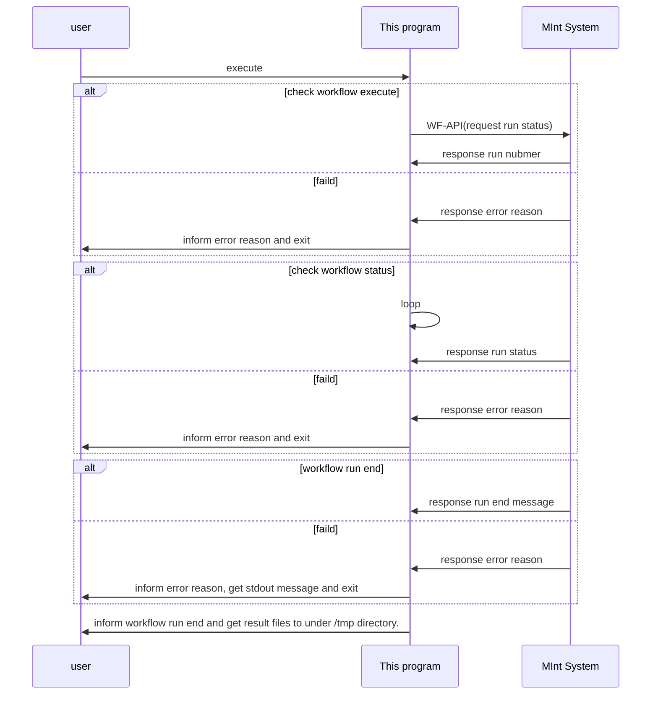

# ワークフロー実行ヘルパープログラム群
ワークフロー内、またはMIntシステム外（例えばWindowsPCやLinux環境など)からワークフローを実行させるためのヘルパーライブラリ、プログラム群。

## 概要
ワークフローAPIを使用するための簡単なスクリプト。APIをプログラムなどから利用するための手間を省き、必要な設定値（APIトークン、URL、サイトID、ワークフローID、ランIDなど）を指定するだけでワークフローAPIで利用可能なAPI呼び出しが使用可能になる。

## 使い方
このリポジトリにはいくつかのスクリプトがある。それぞれについて説明する。
* common_lib.py   ----- API呼び出し用関数のクラス
* erfh5_lib.py          - SYSWELDが作成する、erfh5ファイルをXMLやpython辞書に変換するためのスクリプト
* erfh5_xml_part.py     - 同erfh5ファイルをXMLに変換する際に別pythonスクリプトをthreadingとsubprocessで実行するが、そのためのスクリプト
* workflow_execute.py   - ワークフローを連続または１つだけ動作させるスクリプト
* workflow_extract.py   - ワークフロー情報をjson形式で出力するスクリプト
* workflow_lib.py       - 予測モジュール実行時にmiapiをラップして使いやすくしたスクリプト
* workflow_params.py    - ワークフローのパラメータ一覧を出力するスクリプト
* workflow_rundetail.py - ラン詳細を得るスクリプト
* workflow_runlist.py   - 指定されたワークフローを実行したラン番号のリストを返す。
* workflow_changest.py  - 指定されたランのステータスを実行中止(canceled)へ変更する。
* parent_job_servei.sh  - １つ目を親のジョブIDとし、２つめ以降はそこから実行された子のジョブとして監視。親ジョブが終了（ワークフローキャンセルなど）した場合は子のジョブを削除する。
~~ pairgraph.py          - タブ区切りのCSVファイルからペアプロットを作成する。
  + Thermo-Calc実行スクリプト専用
  + 要matplotlib、seabornパッケージ~~
* workflow_create.py    - ワークフローを登録する。

※ 対応するpythonのバージョンは3.6以上を想定している。2.6または2.7でも動作可能かもしれないが、保証はしない。

## 詳細
各プログラム、ライブラリの詳細と使い方。

### 推奨環境
* python : 3.6以上（4.xは未確認）
* パッケージ
  + requests

### 共通の使い方　　
ほぼ全てのプログラムは、以下のパラメータが必要となる。

* URL : nims.mintsys.jpのような使用しているMIntシステムのホスト名＋ドメイン名。
* APIトークン : API使用を利用する権利を持っているユーザーに発行される６４文字のMIntシステムAPIへのアクセストークン。

### erfh5リーダー

ERFH5(拡張子erfh5)フォーマットを読むためのライブラリ
* erfh5_lib.py
* erfh5_xml_part.py

### workflow_lib.py 
予測モジュール実行用スクリプト内でクラスインスタンスを作成して使用する。予測モジュール実行用スクリプトもできればpythonが望ましい。ワークフローの入力と出力に対する定義を用意し、ソルバー実行を行う。定義は以下のとおりの書式のpython辞書を用意（記述）する。

* 使い方
  + 予測モジュールで指定した実行プログラムでimportし、インスタンスを作成して使用する。
  ```
  sys.path.append("/home/misystem/assets/modules/workflow_python_lib")
  from workflow_lib import *
  ```
  + pythonパスを追加し、読み込む。

* inputポート用定義  
  ```
  inputports = {
    "inputポート名":"",
  }
  ```
* outputポート用定義  
  ```
  outputports = {
    "outputポート名":"",
  }
  ```
* inputポート名と実ファイル名との変換用  
  ```
  in_realnames = {
    "inputポート名":"実ファイル名",
  }
  ```
* outputポート名と実ファイル名との変換用  
  ```
  out_realnames = {
    "実ファイル名":"outputポート名",
  }
  ```
* インスタンス作成と定義の読み込み  
定義を作成したら、クラスをインスタンス化し、定義を読み込ませ、インスタンスの初期化を行う。クラス名は「MIApiCommandClass」
  ```
  wf_tool = MIApiCommandClass()
  wf_tool.setInportNames(inputports)
  wf_tool.setOutportNames(outputports)
  wf_tool.setRealName(in_realnames, out_realnames)
  wf_tool.Initialize(translate_input=True, translate_output=True)
  ```
  + インスタンス化はパラメータ不要。  
  + パラメータのtranslate_inputおよびtranslate_outputはポート名から実ファイル名へのシンボリックリンク作成を行うかどうかのフラグである。Trueを設定すれば、行う。  
  + Initializeメンバー関数はmiapiの初期化を行う。実行時、translate_inputがTrueの場合、inputポートのポート名と実ファイル名の変換（コピー動作、シンボリックリンクではない）を行う。

* ソルバー実行
ソルバー実行のために、ソルバー名（Zabbixなどで定期的に情報集約して使用率を計測する用）の設定を行い、ソルバーを実行する。ExecSolverメンバー関数内で、ソルバーログに実行開始、終了が日時と共に記録される。
  ```
  cmd = "ソルバー実行行"
  wf_tool.solver_name = "ソルバー名"
  wf_tool.ExecSolver(cmd)
  ```
  + ソルバー実行行はコマンド名とパラメータ  
  + ソルバーログは、~/assets/workflow/[サイト番号]/solver_logs以下である。  
  + ExecSolverメンバー関数実行後、translate_outputがTrueの場合に、各ポート名と実ファイル名の変換（コピー動作、シンボリックリンクではない）を行う。このメンバー関数を使用しない場合はoutputポートのポート名と実ファイルの変換は行われない。行いたい場合は次の実行後の処理にある、PostProcessメンバー関数を実行する。
  + ソルバー実行ログ例
    ```
    2020/03/19 10:16:12: start: sysWeld: 200000100000001: 9cc0f5c1-da33-4e2b-b87e-a26884f08e48: None: W000020000000268
    2020/03/19 10:20:32: normal end: sysWeld: 200000100000001: 9cc0f5c1-da33-4e2b-b87e-a26884f08e48: None: W000020000000268
    ```
    - 日時、状況、ソルバー名、ランの実行者ID、ソルバー実行用個別ID、ラン番号（未対応）、ワークフローIDが記録されている。
    - 状況は、start(開始)/normal end(正常終了)/abnormal end(異常終了)のどれかである。
    - ソルバー実行用個別IDはExecSolver毎に発行されるUUIDである。

* 実行後の処理いくつか
  + ExecSolverを実行し無かった場合に実行して、outputポートのポート名と実ファイル名の変換を行う。
    ```
    wf_tool.PostProcess()
    ```
  + いくつかあるファイルの最後のファイルをoutputポートのポート名にする。
    ```
    wf_tool.copyLastTimeStampfile("Ni-Al_*.vtk", "ニッケル熱処理計算の結果ファイル")
    ```
    ※ 簡単なファイルパターンを入れて、マッチするファイル群から作成日時の最後のものをポート名にコピーする。

### workflow_params.py
ワークフロー実行用パラメータ（ポート名）取得プログラム。  
このプログラムを利用して、実行したいワークフローのパラメータ（ポート名）を取得する。後述の実行用プログラムで必要なパラメータ（ポート名）と対応するファイルを指定するのに使用する。

* パラメータ一覧取得   
  実行に必要なパラメータ
  + 共通パラメータ
  + ワークフローID
  以下のコマンドラインで一覧を取得する。
  ```
  python3.6 /home/misystem/assets/modules/workflow_python_lib/workflow_params.py workflow_id:W000020000000219 token:64文字のトークンを指定する misystem:dev-u-tokyo.mintsys.jp
  ```
  これを実行すると、以下のような返信がある。  
  ```
  input parameters
  port = weld_shape_pf_param_py_01(True)
  port = クランプ終了時間_01(True)
  port = クランプ開始時間_01(True)
  port = 入熱量_01(True)
  port = 冷却終了温度_01(True)
  port = 冷却開始時間_01(True)
  port = 初期温度_01(True)
  port = 初期組織の相分率_01(True)
  port = 効率_01(True)
  port = 溶接幅_01(True)
  port = 溶接終了時間_01(True)
  port = 溶接長さ_01(True)
  port = 溶接開始時間_01(True)
  port = 熱源移動速度_01(True)
  port = 環境温度_01(True)
  port = 貫通_01(True)
  output for results
  port = 作成したメッシュ先端_01(file)
  port = 作成したメッシュ全体_01(file)
  port = 最大温度分布画像_01(file)
  port = 最高温度_01(file)
  port = 残留応力_01(file)
  port = 残留応力画像_01(file)
  port = 溶接画像_01(file)
  port = 硬さ分布_01(file)
  port = 硬さ分布画像_01(file)
  port = 粒径情報_01(file)
  port = 結果ファイル_01(file)
  ```

※　input parametersからoutput for resultsの間にリストされたのが、入力ポート名である。これを「ポート名:対応するファイル名」として、必要なだけ、実行プログラムのコマンドラインパラメータとして構成する。
※　ポート名に(True)となっているのは必須であり、省略できないことを示している。

### workflow_execute.py
ワークフロー実行用API呼び出しプログラム。
あらかじめトークンを用意するか、認証プログラムで前もってログイン処理を行いトークンを入手しておく。パラメータ一覧を入手し、実行スクリプトで「パラメータ:対応するファイル名」という実行時引数を必要な数だけ構成し実行する。「SYSWELD最適化ワークフロー」を例に説明する。


* 準備  
  必要なパラメータ（ポート名）をworkflow_params.pyを実行して取得しておく。

* 実行  
  実行に必要なパラメータ
  + 共通パラメータ
  + ワークフローID
  + 必要なポート名と対応するファイル名
  上記workflow_params.pyの実行結果を参考にすると以下のようになる。
  ```
  python3.6 /home/misystem/assets/modules/workflow_python_lib/workflow_execute.py workflow_id:W000020000000219 token:64文字のトークンを指定する misystem:dev-u-tokyo.mintsys.jp weld_shape_pf_param_py_01:weld_shape_pf_param.py クランプ終了時間_01:Clamping_End_Time.dat クランプ開始時間_01:Clamping_Initial_Time.dat 入熱量_01:Energy.dat 冷却終了温度_01:Cooling_End_Time.dat 冷却開始時間_01:Cooling_Initial_Time.dat 初期温度_01:Initial_Temperature.dat 初期組織の相分率_01:init_microstructure.txt 効率_01:Efficiency.dat 溶接幅_01:Width.dat 溶接終了時間_01:Welding_End_Time.dat 溶接長さ_01:Length.dat 溶接開始時間_01:Welding_Initial_Time.dat 熱源移動速度_01:Velocity.dat 環境温度_01:Amient_Temp.dat 貫通_01:Penetration.dat number:-1
  ```

  ※ number:-1 は連続実行用のパラメータ指定子。-1なのはこのプログラムはnumberに1以上の整数を指定すると、同時実行中のランが指定した数以下のうちは連続してランを実行する。-1の場合は1つ実行し、終了したら、実行プログラムを終了する。

* 実行開始後
  
  + 実行開始から終了まで  
    ```
    2020/07/28 13:24:02 - ワークフロー実行中（R000110000606859）
    2020/07/28 13:24:02 - ラン詳細ページ  https://nims.mintsys.jp/workflow/runs/110000606859
    2020/07/28 13:24:02 - 実行ディレクトリ /home/misystem/assets/workflow/site00011/calculation/94/da/28/d4/00/26/44/c8/80/ef/a9/cd/c2/87/74/f1
    2020/07/28 13:24:13 - ラン実行ステータスがcompletedに変化したのを確認しました
    2020/07/28 13:24:13 - ワークフロー実行終了
    ```
    という表示が行われる。

  + 実行終了時、outputポート名のファイルを/tmp/ラン番号ディレクトリ以下に出力し、そのファイル名を一覧として出力する。
    終了時の一例
    ```
    2020/07/28 13:24:13 - フェライトとパーライトの硬さ 取得中...
    フェライトとパーライトの硬さ:/tmp/R000110000606859/フェライトとパーライトの硬さ
    2020/07/28 13:24:14 - ベイナイトの硬さ 取得中...
    ベイナイトの硬さ:/tmp/R000110000606859/ベイナイトの硬さ
    2020/07/28 13:24:14 - マルテンサイトの硬さ 取得中...
    マルテンサイトの硬さ:/tmp/R000110000606859/マルテンサイトの硬さ
    2020/07/28 13:24:14 - 硬さ 取得中...
    硬さ:/tmp/R000110000606859/硬さ
    ```
    ※ /tmp以下はシステムにもよるが30日前後でクリーンアップされ、一般ファイルは削除されるので、注意。

  + 実行停止  
    途中ctrl+Cでスクリプトの処理自体は停止させられるが、実行中だったり、待ち合わせ中などの場合は、前者ならステータスの変化、後者なら待ち合わせ終了後の実行タイミングまでスクリプトは終了しません。またワークフロー自体の停止も行いません。signal処理しているので、ctrl+Cのみこの様な挙動になる。
    + 強制停止したい場合は ctrl+Zで停止させ、
    ```
    $ kill -9 %1
    ```
    で強制終了させる。
　  + この場合でもワークフロー実行は停止、終了はしません。 
  + 異常終了  
    ワークフローが異常終了した場合は、各ツールのstdoutとラン詳細のJSONファイルをMIntシステムより取得し保存する。前者は「ツール名.log」。後者は「run_ラン番号_detail.log」という名前になる。
  + その他  
    ワークフローAPIプログラムの異常など異常終了以外の異常応答は５分後リトライを５回まで行う。回復しない場合は終了する。

### workflow_runlist.py
ライブラリとしては、ワークフローIDから対応するランのラン番号リストなどの辞書を返すプログラムである。単体実行した時は実行時ディレクトリやラン詳細のURLを表示する。

件数が多い場合の処理は含まれていないので、注意すること。

* 実行  
  実行に必要なパラメータ
  + 共通パラメータ
  + ワークフローID
  + サイトID
  + トークン（無い場合はユーザーIDとパスワードによるログイン処理を実行する）
  ```
  python3.6 workflow_runlist.py [token:<APIトークン>] misystem:dev-u-tokyo.mintsys.jp workflow_id:W000020000000217 siteid:site00002
  ```
* 単体実行すると以下のような表示が行われる。  
  ```
  $ python3.6 workflow_runlist.py workflow_id:W000020000000283 misystem:dev-u-tokyo.mintsys.jp siteid:site00002 result:true
  processing parameter workflow_id
  workflow_id is W000020000000283
  processing parameter misystem
  url for misystem is dev-u-tokyo.mintsys.jp
  processing parameter siteid
  siteid is site00002
  processing parameter result
  ログインID: utadmin01
  パスワード: 
  RunID : R000020000531497
                 開始 : 2020/07/21 09:24:00
                 終了 : 2020/07/21 11:39:38
           ステータス : canceled
          ラン詳細URL : https://dev-u-tokyo.mintsys.jp/workflow/runs/20000531497
    実行時ディレクトリ: /home/misystem/assets/workflow/site00002/calculation/3d/38/65/5d/11/ad/4f/9d/a6/1d/3c/a2/d0/65/51/84
  RunID : R000020000531496
                 開始 : 2020/07/21 09:17:41
                 終了 : 2020/07/21 09:19:36
           ステータス : abend
          ラン詳細URL : https://dev-u-tokyo.mintsys.jp/workflow/runs/20000531496
    実行時ディレクトリ: /home/misystem/assets/workflow/site00002/calculation/6c/e9/0e/ed/96/a7/4a/f0/bb/78/8a/ba/0e/50/71/e8
  RunID : R000020000531495
                 開始 : 2020/07/21 09:13:22
                 終了 : 2020/07/21 09:13:36
           ステータス : abend
          ラン詳細URL : https://dev-u-tokyo.mintsys.jp/workflow/runs/20000531495
    実行時ディレクトリ: /home/misystem/assets/workflow/site00002/calculation/ec/fa/29/71/2a/f1/47/91/8c/45/86/41/20/66/32/8a
  ```
  内部の関数では上記結果はリストで返る。

* 関数呼び出し  
  importして関数として呼び出すことも可能である。

  ```python
  def get_runlist(token, url, siteid, workflow_id):
    '''
    ラン詳細の取得
    @param token (string) APIトークン
    @param url (string) URLのうちホスト名＋ドメイン名。e.g. dev-u-tokyo.mintsys.jp
    @param siteid (string) サイトID。e.g. site00002
    @param workflow_id (string) ワークフローID。e.g. W000020000000197
    @retcal (list) {"runid":ランID, "status":ステータス, "description":説明} と言う辞書のリスト
    '''
  ```
* 辞書は以下のような内容
  ```python
  {"run_id":"Rxxxxxyyyyyyyyyy", "status":"completed", "description":"", "uuid":"", "start":"<creation_time>", "end":"<modification_time>"}
  ```
  日時はJSTである。

### workflow_rundetail.py
ラン詳細を取得するプログラムである。
* 実行  
  実行に必要なパラメータ
  + 共通パラメータ
  + ランID
  + サイトID
  ```
  python3.6 workflow_rundetail.py token:<APIトークン>  misystem:dev-u-tokyo.mintsys.jp run_id:R000020000365301 siteid:site00002
  ```
  実行すると以下のような表示が行われる。  
  ```
  {
    "completion_time": "2019-11-28T02:27:11Z",
    "creation_time": "2019-11-28T02:09:16Z",
    "creator_id": "200000100000001",
    "creator_name": "東大システム管理者０１",
    "description": "API経由ワークフロー実行 2019-11-28 11:09:14.415349\n\nparameter\n等温時効                :888.93\n析出相の体積分率            :0.177\n",
    "downloaded": false,
    "gpdb_url": "https://dev-u-tokyo.mintsys.jp:50443/gpdb-api/v2/runs/54a70a47-2029-4737-8d8b-0be00d162073",
    "is_interactive": false,
    "log_size": 911,
    "loop_count": 0,
    "modified_by_id": "200000100000001",
    "modified_by_name": "東大システム管理者０１",
    "modified_time": "2019-11-28T02:27:22Z",
    "run_id": "http://dev-u-tokyo.mintsys.jp/workflow/runs/R000020000365301",
    "status": "completed",
    "workflow_id": "http://dev-u-tokyo.mintsys.jp/workflow/workflows/W000020000000197",
    "workflow_name": "Ni-Al熱処理シミュレーション",
    "workflow_revision": 4
  }

  /home/misystem/assets/workflow/site00002/calculation/54/a7/0a/47/20/29/47/37/8d/8b/0b/e0/0d/16/20/73
  ```
  内部の関数を呼ぶと詳細情報のJSONデータのみが返される。

* 関数呼び出し  
  importして関数として呼び出すことも可能である。
  ```
  def get_rundetail(token, url, siteid, runid, with_result=False, debug=False):
    '''
    ラン詳細の取得
    @param token (string) APIトークン
    @param url (string) URLのうちホスト名＋ドメイン名。e.g. dev-u-tokyo.mintsys.jp
    @param siteid (string) サイトID。e.g. site00002
    @param run_id (string) ランID。e.g. R000020000365545
    @retval (dict)
    '''
  ```

### workflow_iourl.py
指定したラン番号の入出力ファイルURLの一覧を取得します。
* 実行  
  実行に必要なパラメータ。
  実行に必要なパラメータ
  + 共通パラメータ
  + ランID
  + サイトID
  ```
  python3.6 workflow_iourl.py token:<APIトークン>  misystem:dev-u-tokyo.mintsys.jp run_id:R000020000365301 siteid:site00002
  ```
  実行すると以下のような表示が行われる。  
  ```
  {
    "R000020000464367": {
      "loop": 0,
      "pyin": [
        "https://dev-u-tokyo.mintsys.jp:50443/gpdb-api/v2/runs/",
        1
      ],
      "pysaveto": [
        "https://dev-u-tokyo.mintsys.jp:50443/gpdb-api/v2/runs/",
        4
      ],
      "pyout": [
        null,
        null
      ]
    }
  }
  ```

* 関数呼び出し  
  importして関数として呼び出すことも可能である。
  ```
  def get_runiofile(token, url, siteid, runid, with_result=False, thread_num=0):
    '''
    入出力ファイルURL一覧の取得
    @param token (string) APIトークン
    @param url (string) URLのうちホスト名＋ドメイン名。e.g. dev-u-tokyo.mintsys.jp
    @param siteid (string) サイトID。e.g. site00002
    @param runid (string) ランID。e.g. R000020000365545
    @param with_result (bool) この関数を実行時、情報を標準エラーに出力するか
    @retval (dict) {"runID":{"ポート名":[ファイルURL, ファイルサイズ]}}
    '''
  ```

### extract_io_ports.py
予測モジュールファイルから、common_libを使用して作成した予測モジュール用実行ファイル画必要とする入力ポートおよび出力ポートのエントリ部分を作成する。

* Usage
```
Usage python3.6 extract_io_ports.py <prediction_id> <modules.xml> [-c[:前段のモジュール名]]

    バージョン番号は、最新（各数字が最大）のもの

    prediction_id : Pで始まる予測モジュール番号。assetでinport後、exportしたあとのmodules.xmlを使う
    modules.xml   : assetで、exportしたXMLファイル。
        -c        : チェックオンリー。パラメータの長さのみ計算
  :前段のモジュール名 : 一つ前の予測モジュール名を一つ
                  : Wxxxxxyyyyyyyyyy_予測モジュール名_02 という形式
```

* 出力
  + ```<objectPathに記述されたプログラム名>_import.py```というファイル名のファイルを作成する。

### parent_job_survai.sh
自らもTorqueのバッチジョブとして実行中のプログラム(親ジョブとする）が、さらに子プログラムをTorqueのバッチジョブ実行する時に、子プログラム（子ジョブとする）を親ジョブが先にいなくなった場合に連動してバッチジョブ登録を削除(qdel)できるようにするスクリプトである。このスクリプトをTorqueバッチジョブとして実行する。

* 使い方
  ```
  $ sh parent_job_survai.sh <親ジョブID> <ログファイル> <子ジョブ１> <子ジョブ２> ...
  ```
* 特徴
  + 予測モジュールから実行したプログラムが実行したバッチジョブプログラムはワークフローをキャンセルした時に連動してキャンセルされない。
  + このプログラムを別途バッチジョブ登録して実行して、親ジョブを監視することで、対応できる。
  + バッチジョブ登録する必要があるのは、親ジョブがTorque登録を削除されるとkill -15に続いてkill -9されるため、15をシグナルキャッチできても対応できない。
  + そもそも現在のワークフロー実行用ジョブスクリプトはシグナルキャッチをしてない。


### workflow_create.py
ワークフローを登録する。
* 実行

  実行に必要なパラメータ。
  + 共通パラメータ
  + 登録するワークフロー名

  任意指定のパラメータ。
  + 登録するワークフローの説明
  + 登録するワークフローに設定する予測モデルID。URI形式
  + 登録するワークフローに関連付けたいワークフローID。URI形式
  + 関連付けたいワークフローのリビジョン番号
  + ワークフロー定義(miwf)ファイル名

  実行方法
  ```
  python3.6 workflow_create.py token:<APIトークン> misystem:dev-u-tokyo.mintsys.jp name:<ワークフロー名> description:<ワークフロー説明> prediction_model_id:http://mintsys.jp/inventory/prediction-models/M000020000004476 reference_workflow_id:http://mintsys.jp/workflow/workflows/W000020000000324 reference_workflow_revision:1 miwf_file:W000020000000324.miwf
  ```
  実行すると以下のような表示が行われる。  
  ```
    2021/04/27 11:16:28 - ワークフロー登録終了 - <ワークフローID>
  ```

* 関数呼び出し  
  importして関数として呼び出すことも可能である。
  ```
    def workflow_create(token, url, name, description, prediction_model_id, reference_workflow_id, reference_workflow_revision, miwf):
        '''
        ワークフロー登録
        @param token (string) APIトークン
        @param url (string) URLのうちホスト名＋ドメイン名。e.g. dev-u-tokyo.mintsys.jp
        @param name (string) 登録するワークフロー名
        @param description (string) 登録するワークフローの説明
        @param prediction_model_id (string) 登録するワークフローに設定する予測モデルID。URI形式
        @param reference_workflow_id (string) 登録するワークフローに関連付けたいワークフローID。URI形式
        @param reference_workflow_revision (int) 関連付けたいワークフローのリビジョン番号
        @param miwf (json) 登録するワークフローに設定する、ワークフロー定義 ※ファイル名ではない
        @retval ワークフローID（W+15桁の数値）(string)
        '''
  ```


# 参考文献
* pairgraph
  + [seaborn.pariplot](https://seaborn.pydata.org/generated/seaborn.pairplot.html#seaborn.pairplot)
  + [Python, pandas, seabornでペアプロット図（散布図行列）を作成](https://note.nkmk.me/python-seaborn-pandas-pairplot/)

